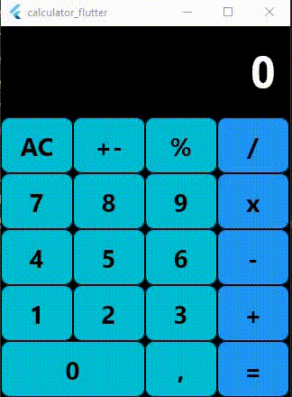

<h1 align="center">Calculator Flutter Desktop</h1>

<h1 align="center"> 
  
</h1>

<p align="center">
  <a href="#dart-about">About</a> &#xa0; | &#xa0; 
  <a href="#sparkles-features">Features</a> &#xa0; | &#xa0;
  <a href="#rocket-technologies">Technologies</a> &#xa0; | &#xa0;
  <a href="#white_check_mark-requirements">Requirements</a> &#xa0; | &#xa0;
  <a href="#checkered_flag-starting">Starting</a> &#xa0; | &#xa0;
  <a href="#memo-license">License</a> &#xa0; | &#xa0;
  <a href="https://github.com/wallacewolv" target="_blank">Author</a>
</p>

<br>

## :dart: About ##

Application developed with Flutter 2.0 from desktop Windows, Linux and MacOS.

## :sparkles: Features ##

:heavy_check_mark: Add function\
:heavy_check_mark: Subtract function\
:heavy_check_mark: Split function\
:heavy_check_mark: Multiply function\
:heavy_check_mark: Add + - function\
:heavy_check_mark: Display wipe function (AC)\
:heavy_check_mark: Percentage function\
:heavy_check_mark: Add function. (,)


## :rocket: Technologies ##

The following tools were used in this project:

- [Flutter 2.0](https://events.flutter.dev/)
- [Power Shell 5.0](https://docs.microsoft.com/pt-br/skypeforbusiness/set-up-your-computer-for-windows-powershell/download-and-install-windows-powershell-5-1)

## :white_check_mark: Requirements ##

Before starting :checkered_flag:, you need to have [Flutter](https://flutter.dev/)  and [ADB Android](https://developer.android.com/studio/command-line/adb?hl=pt-br) our [VS CODE](https://code.visualstudio.com/) installed.

## :checkered_flag: Starting ##

```bash
# Clone this project
$ git clone https://github.com/wallacewolv/calculator_flutter

# Access
$ cd calculator_flutter

# Run the project
$ Debug on your Android device our VS Code

```

## :memo: License ##

This project is under license from MIT. For more details, see the [LICENSE](LICENSE) file.


Made with :heart: by <a href="https://github.com/wallacewolv" target="_blank"> Wallace</a>

&#xa0;

<a href="#top">Back to top</a>
